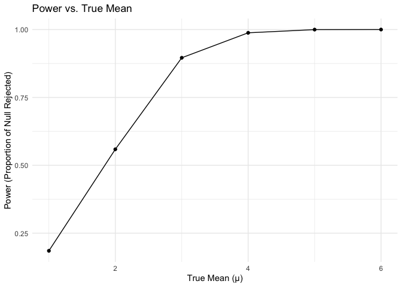
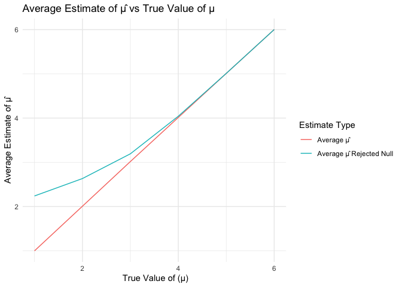

p8105_hw5_tc3326
================
KK Chen
2024-11-15

# Problem 2

### Set Parameters and Simulate Data

``` r
simulate_t_test = function(true_mean, sample_size = 30, std_dev = 5) 
  {
  simulated_data = tibble(sample_values = rnorm(sample_size, true_mean, std_dev))
  t_test_result = t.test(simulated_data$sample_values, mu = 0)
  cleaned_result = broom::tidy(t_test_result)
  
  result = tibble(
    sample_mean = cleaned_result$estimate,
    p_value = cleaned_result$p.value,
  )
  
  return(result)
  }
```

``` r
simulation_results_mu_0 = 
  tibble(iter = 1:5000) %>%
  mutate(simulation_output = map(iter, ~simulate_t_test(true_mean = 0))) %>%
  unnest(simulation_output)

simulation_results_mu_0
```

    ## # A tibble: 5,000 × 3
    ##     iter sample_mean p_value
    ##    <int>       <dbl>   <dbl>
    ##  1     1      1.22     0.216
    ##  2     2     -0.0691   0.931
    ##  3     3     -0.384    0.632
    ##  4     4     -0.152    0.883
    ##  5     5     -0.851    0.318
    ##  6     6      0.930    0.369
    ##  7     7     -0.0623   0.944
    ##  8     8     -0.565    0.413
    ##  9     9      0.600    0.488
    ## 10    10      0.112    0.906
    ## # ℹ 4,990 more rows

``` r
true_mean_values = c(1, 2, 3, 4, 5, 6)

sim_res_multiple_means = 
  expand_grid(
    true_mean = true_mean_values,
    iter = 1:5000 ) %>%
  mutate(simulation_output = map(true_mean, ~simulate_t_test(true_mean = .x))) %>%
  unnest(simulation_output, names_sep = "_")

sim_res_multiple_means
```

    ## # A tibble: 30,000 × 4
    ##    true_mean  iter simulation_output_sample_mean simulation_output_p_value
    ##        <dbl> <int>                         <dbl>                     <dbl>
    ##  1         1     1                        2.02                     0.00948
    ##  2         1     2                        0.994                    0.298  
    ##  3         1     3                       -0.137                    0.882  
    ##  4         1     4                        2.78                     0.00751
    ##  5         1     5                        0.459                    0.656  
    ##  6         1     6                        1.40                     0.0660 
    ##  7         1     7                       -1.19                     0.236  
    ##  8         1     8                        2.47                     0.00445
    ##  9         1     9                        1.56                     0.0761 
    ## 10         1    10                        0.0392                   0.966  
    ## # ℹ 29,990 more rows

### Plot: Power of Test vs. True Mean

``` r
power_plot <- sim_res_multiple_means %>%
  group_by(true_mean) %>%
  summarize(power = mean(simulation_output_p_value < 0.05)) %>%
  ggplot(aes(x = true_mean, y = power)) +
  geom_line() +
  geom_point() +
  labs(
    title = "Power vs. True Mean",
    x = "True Mean (µ)",
    y = "Power (Proportion of Null Rejected)"
  ) +
  theme_minimal()

power_plot
```

<!-- -->

\*As the effect size increases, the power of the test also increases. As
the effect size grows (the difference between the true mean and the null
hypothesis mean of 0 becomes larger), the test becomes more likely to
reject the null hypothesis, resulting in higher power. Also, there is
non-linear growth. The power rises substantially from μ=1 to μ=3.
However, as μ approaches 5 and 6, the power begins to plateau near 1.
This suggests that once the effect size is large enough, almost all
tests reject the null hypothesis, reaching close to 100% power.

### Plot: Average estimate of 𝜇̂ vs True value ofμ

``` r
mean_estimates_plot <- sim_res_multiple_means %>%
  group_by(true_mean) %>%
  summarize(
    avg_sample_mean = mean(simulation_output_sample_mean),
    avg_sample_mean_rejected = mean(simulation_output_sample_mean[simulation_output_p_value < 0.05])
  ) %>%
  ggplot(aes(x = true_mean)) +
  geom_line(aes(y = avg_sample_mean, color = "Average μ̂")) +
  geom_line(aes(y = avg_sample_mean_rejected, color = "Average μ̂ Rejected Null")) +
  labs(
    title = "Average Estimate of μ̂ vs True Value of μ",
    x = " True Value of (µ)",
    y = "Average Estimate of μ̂",
    color = "Estimate Type"
  ) +
  theme_minimal()

mean_estimates_plot
```

<!-- -->

- Yes, the sample average of μ̂ across tests where the null was rejected
  is approximately equal to the true value of μ, particularly for higher
  values of μ. This alignment occurs because larger effect sizes reduce
  selection bias. Larger effect sizes make it easier to detect a true
  difference from zero, resulting in a higher proportion of samples
  where the null hypothesis is rejected (improve power of test).
