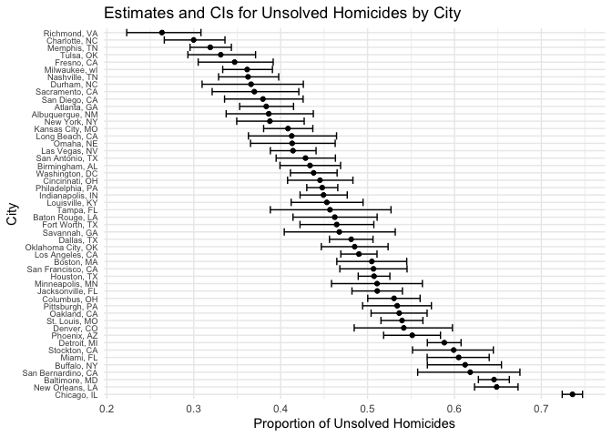

p8105_hw5_tc3326
================
KK Chen
2024-11-15

# Problem 2

### Set Parameters and Simulate Data

``` r
simulate_t_test = function(true_mean, sample_size = 30, std_dev = 5) 
  {
  simulated_data = tibble(sample_values = rnorm(sample_size, true_mean, std_dev))
  t_test_result = t.test(simulated_data$sample_values, mu = 0)
  cleaned_result = broom::tidy(t_test_result)
  
  result = tibble(
    sample_mean = cleaned_result$estimate,
    p_value = cleaned_result$p.value,
  )
  
  return(result)
  }
```

``` r
simulation_results_mu_0 = 
  tibble(iter = 1:5000) %>%
  mutate(simulation_output = map(iter, ~simulate_t_test(true_mean = 0))) %>%
  unnest(simulation_output)

simulation_results_mu_0
```

    ## # A tibble: 5,000 × 3
    ##     iter sample_mean p_value
    ##    <int>       <dbl>   <dbl>
    ##  1     1      -1.05   0.277 
    ##  2     2       0.638  0.425 
    ##  3     3      -0.778  0.345 
    ##  4     4       1.49   0.0888
    ##  5     5      -0.865  0.407 
    ##  6     6       0.356  0.705 
    ##  7     7       0.247  0.706 
    ##  8     8       1.08   0.164 
    ##  9     9      -0.351  0.697 
    ## 10    10       0.142  0.851 
    ## # ℹ 4,990 more rows

``` r
true_mean_values = c(1, 2, 3, 4, 5, 6)

sim_res_multiple_means = 
  expand_grid(
    true_mean = true_mean_values,
    iter = 1:5000 ) %>%
  mutate(simulation_output = map(true_mean, ~simulate_t_test(true_mean = .x))) %>%
  unnest(simulation_output, names_sep = "_")

sim_res_multiple_means
```

    ## # A tibble: 30,000 × 4
    ##    true_mean  iter simulation_output_sample_mean simulation_output_p_value
    ##        <dbl> <int>                         <dbl>                     <dbl>
    ##  1         1     1                         0.683                    0.448 
    ##  2         1     2                         0.225                    0.789 
    ##  3         1     3                         1.50                     0.143 
    ##  4         1     4                         1.64                     0.0792
    ##  5         1     5                         1.77                     0.0290
    ##  6         1     6                         1.67                     0.0890
    ##  7         1     7                         0.839                    0.384 
    ##  8         1     8                        -0.281                    0.775 
    ##  9         1     9                         1.20                     0.143 
    ## 10         1    10                         1.85                     0.0603
    ## # ℹ 29,990 more rows

### Plot: Power of Test vs. True Mean

``` r
power_plot <- sim_res_multiple_means %>%
  group_by(true_mean) %>%
  summarize(power = mean(simulation_output_p_value < 0.05)) %>%
  ggplot(aes(x = true_mean, y = power)) +
  geom_line() +
  geom_point() +
  labs(
    title = "Power vs. True Mean",
    x = "True Mean (µ)",
    y = "Power (Proportion of Null Rejected)"
  ) +
  theme_minimal()

power_plot
```

<!-- -->

\*As the effect size increases, the power of the test also increases. As
the effect size grows (the difference between the true mean and the null
hypothesis mean of 0 becomes larger), the test becomes more likely to
reject the null hypothesis, resulting in higher power. Also, there is
non-linear growth. The power rises substantially from μ=1 to μ=3.
However, as μ approaches 5 and 6, the power begins to plateau near 1.
This suggests that once the effect size is large enough, almost all
tests reject the null hypothesis, reaching close to 100% power.

### Plot: Average estimate of 𝜇̂ vs True value ofμ

``` r
mean_estimates_plot <- sim_res_multiple_means %>%
  group_by(true_mean) %>%
  summarize(
    avg_sample_mean = mean(simulation_output_sample_mean),
    avg_sample_mean_rejected = mean(simulation_output_sample_mean[simulation_output_p_value < 0.05])
  ) %>%
  ggplot(aes(x = true_mean)) +
  geom_line(aes(y = avg_sample_mean, color = "Average μ̂")) +
  geom_line(aes(y = avg_sample_mean_rejected, color = "Average μ̂ Rejected Null")) +
  labs(
    title = "Average Estimate of μ̂ vs True Value of μ",
    x = " True Value of (µ)",
    y = "Average Estimate of μ̂",
    color = "Estimate Type"
  ) +
  theme_minimal()

mean_estimates_plot
```

<!-- -->

- Yes, the sample average of μ̂ across tests where the null was rejected
  is approximately equal to the true value of μ, particularly for higher
  values of μ. This alignment occurs because larger effect sizes reduce
  selection bias. Larger effect sizes make it easier to detect a true
  difference from zero, resulting in a higher proportion of samples
  where the null hypothesis is rejected (improve power of test).

# Problem 3

### Describe the raw data

``` r
homicides = read_csv("./data/homicide-data.csv")
```

    ## Rows: 52179 Columns: 12
    ## ── Column specification ────────────────────────────────────────────────────────
    ## Delimiter: ","
    ## chr (9): uid, victim_last, victim_first, victim_race, victim_age, victim_sex...
    ## dbl (3): reported_date, lat, lon
    ## 
    ## ℹ Use `spec()` to retrieve the full column specification for this data.
    ## ℹ Specify the column types or set `show_col_types = FALSE` to quiet this message.

``` r
print(homicides)
```

    ## # A tibble: 52,179 × 12
    ##    uid        reported_date victim_last  victim_first victim_race victim_age
    ##    <chr>              <dbl> <chr>        <chr>        <chr>       <chr>     
    ##  1 Alb-000001      20100504 GARCIA       JUAN         Hispanic    78        
    ##  2 Alb-000002      20100216 MONTOYA      CAMERON      Hispanic    17        
    ##  3 Alb-000003      20100601 SATTERFIELD  VIVIANA      White       15        
    ##  4 Alb-000004      20100101 MENDIOLA     CARLOS       Hispanic    32        
    ##  5 Alb-000005      20100102 MULA         VIVIAN       White       72        
    ##  6 Alb-000006      20100126 BOOK         GERALDINE    White       91        
    ##  7 Alb-000007      20100127 MALDONADO    DAVID        Hispanic    52        
    ##  8 Alb-000008      20100127 MALDONADO    CONNIE       Hispanic    52        
    ##  9 Alb-000009      20100130 MARTIN-LEYVA GUSTAVO      White       56        
    ## 10 Alb-000010      20100210 HERRERA      ISRAEL       Hispanic    43        
    ## # ℹ 52,169 more rows
    ## # ℹ 6 more variables: victim_sex <chr>, city <chr>, state <chr>, lat <dbl>,
    ## #   lon <dbl>, disposition <chr>

- The dataset contains 52,179 rows and 12 columns. It provides detailed
  information about homicide cases in 50 large U.S. cities. Below is a
  description of each column:  

1.  uid: A unique identifier for each homicide case, formatted with a
    city code prefix.  
2.  reported_date: The date the homicide was reported, recorded as an
    8-digit numeric value in the format YYYYMMDD  
3.  victim_last and victim_first: The last and first names of the
    victim.  
4.  victim_race: The racial or ethnic background of the victim.  
5.  victim_age: The age of the victim at the time of death.  
6.  victim_sex: The gender of the victim.  
7.  city and state: The city and state where the homicide occurred.  
8.  lat and lon: The geographic coordinates (latitude and longitude) of
    the location where the homicide occurred.  
9.  disposition: The outcome status of the case (Closed by arrest or
    Closed without arrest or Open/No arrest).  

### Create a city_state variable and Summarzie

``` r
homicides <- homicides %>%
  mutate(city_state = paste(city, state, sep = ", "))

unsolved_dispositions <- c("Closed without arrest", "Open/No arrest")

homicide_summary <- homicides %>%
  group_by(city_state) %>%
  summarize(
    total_homicides = n(),
    unsolved_homicides = sum(disposition %in% unsolved_dispositions)
  ) %>%
  ungroup()

print(homicide_summary)
```

    ## # A tibble: 51 × 3
    ##    city_state      total_homicides unsolved_homicides
    ##    <chr>                     <int>              <int>
    ##  1 Albuquerque, NM             378                146
    ##  2 Atlanta, GA                 973                373
    ##  3 Baltimore, MD              2827               1825
    ##  4 Baton Rouge, LA             424                196
    ##  5 Birmingham, AL              800                347
    ##  6 Boston, MA                  614                310
    ##  7 Buffalo, NY                 521                319
    ##  8 Charlotte, NC               687                206
    ##  9 Chicago, IL                5535               4073
    ## 10 Cincinnati, OH              694                309
    ## # ℹ 41 more rows

### Estimate Proportion of Unsolved Homicides in Baltimore, MD

``` r
baltimore <- homicides %>%
  filter(city == "Baltimore", state == "MD")

total_homicides <- nrow(baltimore)
unsolved_homicides <- sum(baltimore$disposition %in% unsolved_dispositions)

prop_test_result <- prop.test(x = unsolved_homicides, n = total_homicides)

tidy_prop_test <- broom::tidy(prop_test_result)

estimated_proportion <- tidy_prop_test$estimate
conf_int_lower <- tidy_prop_test$conf.low
conf_int_upper <- tidy_prop_test$conf.high

cat("Estimated Proportion of Unsolved Homicides in Baltimore, MD: ", estimated_proportion, "\n")
```

    ## Estimated Proportion of Unsolved Homicides in Baltimore, MD:  0.6455607

``` r
cat("95% Confidence Interval: [", conf_int_lower, ", ", conf_int_upper, "]\n")
```

    ## 95% Confidence Interval: [ 0.6275625 ,  0.6631599 ]

### Perform prop.test for Each City

``` r
allcity_summary <- homicides %>%
  group_by(city_state) %>%
  summarize(
    total_homicides = n(),
    unsolved_homicides = sum(disposition %in% unsolved_dispositions)
  ) %>%
  ungroup() %>%
  mutate(
    prop_test_result = map2(unsolved_homicides, total_homicides, ~ prop.test(x = .x, n = .y)),
    tidy_result = map(prop_test_result, broom::tidy)
  ) %>%
  unnest(tidy_result) %>%
  select(city_state, total_homicides, unsolved_homicides, estimate, conf.low, conf.high)
```

    ## Warning: There was 1 warning in `mutate()`.
    ## ℹ In argument: `prop_test_result = map2(...)`.
    ## Caused by warning in `prop.test()`:
    ## ! Chi-squared approximation may be incorrect

### Plot that shows the estimates and CIs for each city

``` r
allcity_summary <- allcity_summary %>%
  arrange(desc(estimate)) %>%
  mutate(city_state = factor(city_state, levels = city_state))

ggplot(allcity_summary, aes(x = city_state, y = estimate)) +
  geom_point() +
  geom_errorbar(aes(ymin = conf.low, ymax = conf.high), width = 1) +
  coord_flip() +  # Flip coordinates for better readability
  labs(
    title = "Estimates and CIs for Unsolved Homicides by City",
    x = "City",
    y = "Proportion of Unsolved Homicides"
  ) +
  theme_minimal() +
  theme(axis.text.y = element_text(size = 7))
```

<!-- -->
