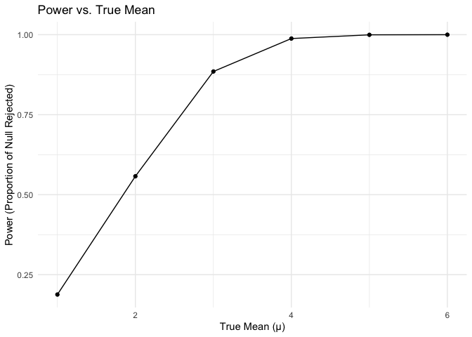

p8105_hw5_tc3326
================
KK Chen
2024-11-15

# Problem 2

### Set Parameters and Simulate Data

``` r
simulate_t_test = function(true_mean, sample_size = 30, std_dev = 5) 
  {
  simulated_data = tibble(sample_values = rnorm(sample_size, true_mean, std_dev))
  t_test_result = t.test(simulated_data$sample_values, mu = 0)
  cleaned_result = broom::tidy(t_test_result)
  
  result = tibble(
    sample_mean = cleaned_result$estimate,
    p_value = cleaned_result$p.value,
  )
  
  return(result)
  }
```

``` r
simulation_results_mu_0 = 
  tibble(iter = 1:5000) %>%
  mutate(simulation_output = map(iter, ~simulate_t_test(true_mean = 0))) %>%
  unnest(simulation_output)

simulation_results_mu_0
```

    ## # A tibble: 5,000 × 3
    ##     iter sample_mean p_value
    ##    <int>       <dbl>   <dbl>
    ##  1     1      0.879   0.345 
    ##  2     2      0.612   0.443 
    ##  3     3      0.582   0.466 
    ##  4     4      0.0825  0.944 
    ##  5     5      0.227   0.817 
    ##  6     6     -0.378   0.707 
    ##  7     7      1.31    0.162 
    ##  8     8      1.69    0.0863
    ##  9     9     -0.100   0.919 
    ## 10    10      0.836   0.322 
    ## # ℹ 4,990 more rows

``` r
true_mean_values = c(1, 2, 3, 4, 5, 6)

sim_res_multiple_means = 
  expand_grid(
    true_mean = true_mean_values,
    iter = 1:5000 ) %>%
  mutate(simulation_output = map(true_mean, ~simulate_t_test(true_mean = .x))) %>%
  unnest(simulation_output, names_sep = "_")

sim_res_multiple_means
```

    ## # A tibble: 30,000 × 4
    ##    true_mean  iter simulation_output_sample_mean simulation_output_p_value
    ##        <dbl> <int>                         <dbl>                     <dbl>
    ##  1         1     1                         0.533                   0.524  
    ##  2         1     2                         1.10                    0.273  
    ##  3         1     3                         0.337                   0.757  
    ##  4         1     4                         0.723                   0.413  
    ##  5         1     5                         1.18                    0.214  
    ##  6         1     6                         1.39                    0.112  
    ##  7         1     7                         1.07                    0.184  
    ##  8         1     8                        -0.563                   0.471  
    ##  9         1     9                         2.93                    0.00558
    ## 10         1    10                         0.532                   0.518  
    ## # ℹ 29,990 more rows

### Plot: Power of Test vs. True Mean

``` r
power_plot <- sim_res_multiple_means %>%
  group_by(true_mean) %>%
  summarize(power = mean(simulation_output_p_value < 0.05)) %>%
  ggplot(aes(x = true_mean, y = power)) +
  geom_line() +
  geom_point() +
  labs(
    title = "Power vs. True Mean",
    x = "True Mean (µ)",
    y = "Power (Proportion of Null Rejected)"
  ) +
  theme_minimal()

power_plot
```

<!-- -->

\*As the effect size increases, the power of the test also increases. As
the effect size grows (the difference between the true mean and the null
hypothesis mean of 0 becomes larger), the test becomes more likely to
reject the null hypothesis, resulting in higher power. Also, there is
non-linear growth. The power rises substantially from μ=1 to μ=3.
However, as μ approaches 5 and 6, the power begins to plateau near 1.
This suggests that once the effect size is large enough, almost all
tests reject the null hypothesis, reaching close to 100% power.
